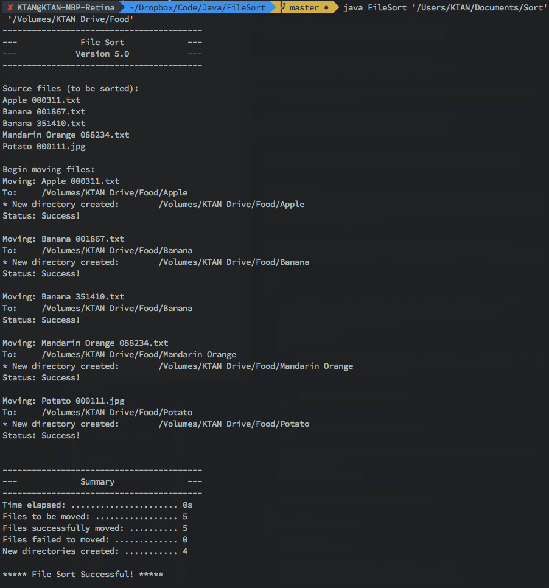

filesort
========



This was created for personal uses. Originally written in Java in a way to practice Java while creating something useful.

Takes the files from the given source path folder and moves them into a folder in the given destination folder. The folder it will be moved into is determined by the file name format "[Folder To Be Moved Into] xxxxxx.xxx".

So if the file name is `Bananas 000001.jpg`, that file will be moved into a folder named `Bananas`.

*Hidden files will be ignored.*

## Usage
First compile `FileSort.java` by running `javac FileSort.java`.

Then call the following command:
```
java FileSort [source path] [destination path]
```

## Output
- If folder does not exist in the destination path, one will be created.
- A summary will be given of time elapsed and how many files moved successfully or failed.
